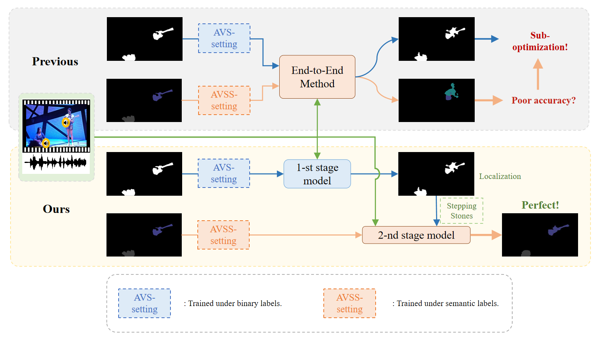
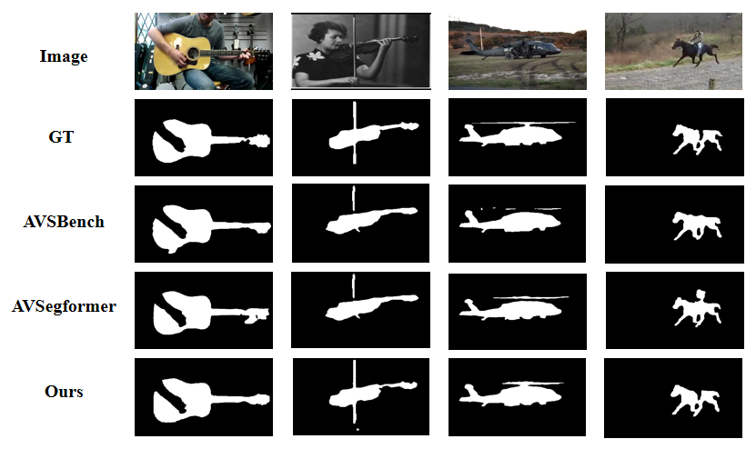
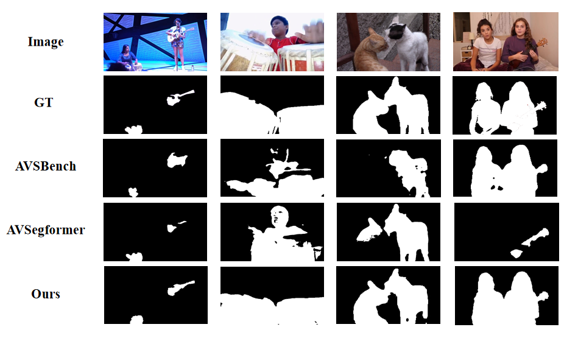
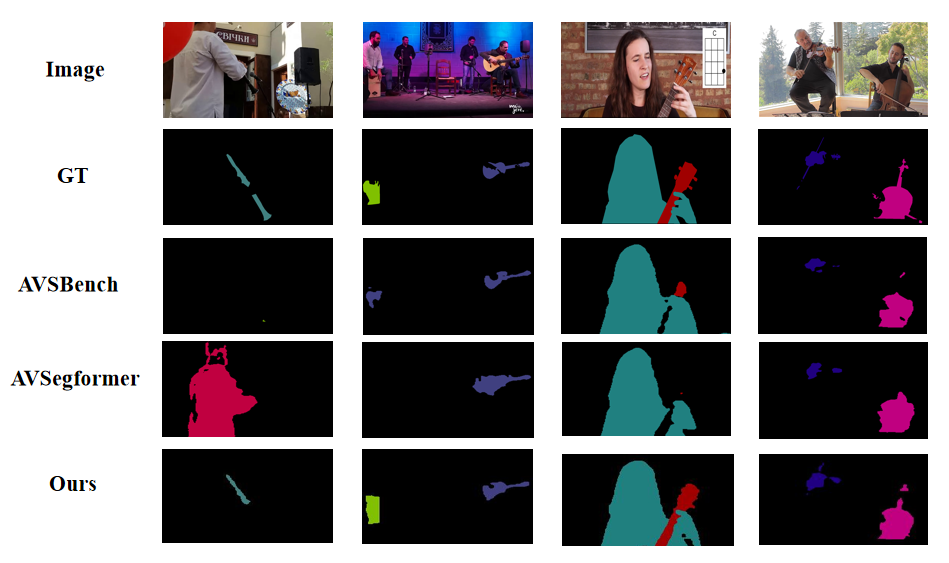

# 💬Stepping-Stones
Here is the official PyTorch implementation of ''*Stepping Stones: A Progressive Training Strategy for Audio-Visual Semantic Segmentation*''. Please refer to our [ECCV 2024 paper](https://arxiv.org/abs/2407.11820) for more details.

**Paper Title: "Stepping Stones: A Progressive Training Strategy for Audio-Visual Semantic Segmentation"**

**Authors: [Juncheng Ma](https://ucasmjc.github.io/), Peiwen Sun, Yaoting Wang and [Di Hu](https://dtaoo.github.io/index.html)**

**Accepted by: European Conference on Computer Vision(ECCV 2024)**

🚀: Project page here: [Project Page](https://gewu-lab.github.io/stepping_stones/)

📄: Paper here: [Paper](https://arxiv.org/abs/2407.11820)

🔍: Supplementary material: [Supplementary](https://gewu-lab.github.io/stepping_stones/static/pdfs/09290-supp.pdf)
## Overview
Audio-Visual Segmentation (AVS) aims to achieve pixel-level localization of sound sources in videos, while Audio-Visual Semantic Segmentation (AVSS), as an extension of AVS, further pursues semantic understanding of audio-visual scenes. However, since the AVSS task requires the establishment of audio-visual correspondence and semantic understanding simultaneously, we observe that previous methods have struggled to handle this mashup of objectives in end-to-end training, resulting in insufficient learning and sub-optimization. Therefore, we propose a two-stage training strategy called Stepping Stones, which decomposes the AVSS task into two simple subtasks from localization to semantic understanding, which are fully optimized in each stage to achieve step-by-step global optimization. This training strategy has also proved its generalization and effectiveness on existing methods. To further improve the performance of AVS tasks, we propose a novel framework Adaptive Audio Visual Segmentation, in which we incorporate an adaptive audio query generator and integrate masked attention into the transformer decoder, facilitating the adaptive fusion of visual and audio features.  Extensive experiments demonstrate that our methods achieve state-of-the-art results on all three AVS benchmarks. 




## Results
### Quantitative comparision
| Method            | S4    |          | MS3   |          | AVSS  |          | Reference |
|-------------------|-------|----------|-------|----------|-------|----------|-----------|
|                   | *mIoU*  | *F-score*  | *mIoU*  | *F-score* | *mIoU* | *F-score*  |           |
| AVSBench          | 78.7 | 87.9    | 54.0 | 64.5     | 29.8 | 35.2     | ECCV'2022 |
| AVSC              | 80.6 | 88.2    | 58.2 | 65.1    | -     | -        | ACM MM'2023 |
| CATR              | 81.4 | 89.6    | 59.0 | 70.0    | 32.8 | 38.5    | ACM MM'2023 |
| DiffusionAVS      | 81.4 | 90.2    | 58.2 | 70.9    | -     | -        | ArXiv'2023 |
| ECMVAE            | 81.7 | 90.1    | 57.8 | 70.8    | -     | -        | CVPR'2023 |
| AuTR              | 80.4 | 89.1    | 56.2  | 67.2     | -     | -        | ArXiv'2023 |
| SAMA-AVS          | 81.5 | 88.6    | 63.1 | 69.1     | -     | -        | WACV'2023 |
| AQFormer          | 81.6 | 89.4    | 61.1 | 72.1    | -     | -        | IJCAI'2023 |
| AVSegFormer       | 82.1 | 89.9    | 58.4 | 69.3    | 36.7 | 42.0    | AAAI'2024 |
| AVSBG             | 81.7 | 90.4     | 55.1 | 66.8     | -     | -        | AAAI'2024 |
| GAVS              | 80.1 | 90.2     | 63.7 | 77.4     | -     | -        | AAAI'2024 |
| MUTR              | 81.5  | 89.8     | 65.0  | 73.0     | -     | -        | AAAI'2024 |
|**AAVS(Ours)**        | **83.2** | **91.3** | **67.3** | **77.6** | **48.5\*** | **53.2\***   | ECCV'2024 |

>  $^*$ indicates that the model uses the Stepping Stones strategy.
### Quantitative comparision

Single Sound Source Segmentation(S4): 


Multiple Sound Source Segmentation(MS3):


Audio-Visual Semantic Segmentation(AVSS):



## Code instruction

### Data Preparation
Please refer to the link [AVSBenchmark](https://github.com/OpenNLPLab/AVSBench) to download the datasets. You can put the data under `data` folder or rename your own folder. Remember to modify the path in config files. The `data` directory is as bellow:
```
|--data
   |--v2
   |--v1m
   |--v1s
   |--metadata.csv
```
For feature extraction, you can refer to [GAVS](https://github.com/GeWu-Lab/Generalizable-Audio-Visual-Segmentation), or we will rebuild our codes and update the code instruction in the future (no later than 2024 August).
### Pre-trained backbone
We use Mask2Former model with Swin-B pre-trained on ADE20k as backbone, which could be downloaded in this [link](https://drive.google.com/file/d/15wI-2M3Cfovl6oNTvBSQfDYKf5FmqooD/view?usp=drive_link). Don't forget to modify the path in [config.py](config.py).
### Training
For S4 and MS3 subtasks, you can simply modify config in [train_avs.sh](train_avs.sh) or run the code using:  
~~~shell
python train.py --task v1s --gpu_id 0 --bs 1 --epochs 30
~~~
For stepping_stones for AVSS subtask, you should put the first stage results from trained AVSS model in a folder at first, and modify the ''mask_path'' in [config.py](config.py). Or you can download results used in our paper in this [link](https://drive.google.com/file/d/1o3k-E4mLf7V9AWoLzJDVAG81gpCdcZXu/view?usp=drive_link).

Then, you can simply modify config in [train_avss.sh](train_avss.sh) or run the code using:
~~~shell
python train.py --task avss --gpu_id 0 --bs 1 --epochs 30
~~~

### Testing
After putting the first stage results in the right place, you can simply run the following code to test.
~~~shell
python test.py --task avss --ckpt_dir "log/best.ckpt" --gpu_id 0 --save_mask
~~~
### Download checkpoints
We also provides pre-trained models for all three subtasks. You can download them from the following links for quick evaluation.

|Subset|mIoU|F-score|Download|
|:---:|:---:|:---:|:---:|
|S4|83.18|91.33|[ckpt](https://drive.google.com/file/d/1nz65IsktkKHpI3i55T7BICUzY_M6MttG/view?usp=drive_link)|
|MS3|67.30|77.63|[ckpt](https://drive.google.com/file/d/1o18EobKKkmCC_RCGO8-I4oDKoL0eDy4-/view?usp=drive_link)|
|AVSS|48.50|53.20|[ckpt](https://drive.google.com/file/d/1o18EobKKkmCC_RCGO8-I4oDKoL0eDy4-/view?usp=drive_link)|

## Citation
If you find this work useful, please consider citing it.

~~~BibTeX
@article{ma2024steppingstones,
          title={Stepping Stones: A Progressive Training Strategy for Audio-Visual Semantic Segmentation},
          author={Ma, Juncheng and Sun, Peiwen and Wang, Yaoting and Hu, Di},
          journal={IEEE European Conference on Computer Vision (ECCV)},
          year={2024},
         }
~~~
